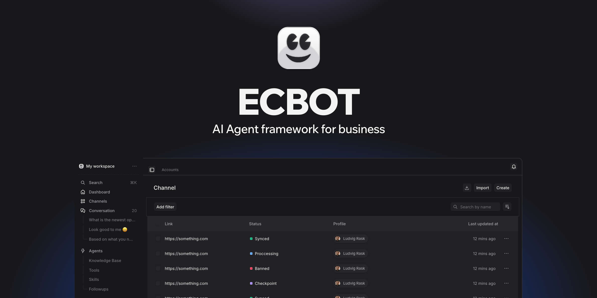

# Ecbot

<p align="center"></p>

<p>
  <a href="./LICENSE"></a>
  <a href="https://github.com/blackmouse572/ecbot/actions/workflows/test-api.yml"></a>
  <a href="https://github.com/blackmouse572/ecbot/actions/workflows/test-ai.yml"></a>
  <a href="https://github.com/blackmouse572/ecbot/actions/workflows/lint-api.yml"></a>
  <a href="./CONTRIBUTING.md"></a>
  <a href="https://discord.gg/WaB5NjCycq"></a>
  <a href="https://github.com/blackmouse572/ecbot/stargazers"></a>
</p>

**The open-source AI sales agent for shops that sell in chat.**

Your customer asks about a size on Messenger at 11pm, confirms the order on Zalo the next morning, and asks where the parcel is on Telegram. Ecbot answers all three as one agent that knows it is the same person. It checks stock and creates the order through your own API, and it hands the chat to your staff the moment the customer gets upset.

Most open-source agent builders stop at Messenger and WhatsApp. Ecbot ships Zalo OA alongside them, replies in Vietnamese by default, and runs on your own server. The code in this repo is the same code that runs Ecbot Cloud, with nothing held back for a paid edition.

**Who it is for**

- **Shops and service businesses** that take orders in chat and want replies at night and on weekends without hiring another shift.
- **Agencies** that build chatbots for clients and want one self-hosted platform, with a workspace per client.
- **Developers** who want a working agent stack (webhooks, queues, RAG, tool calls, handoff) to extend instead of writing one from scratch.

## Channels

| Channel            | Status                                                                          |
| ------------------ | ------------------------------------------------------------------------------- |
| Facebook Messenger | Shipped                                                                         |
| Zalo OA            | Shipped                                                                         |
| Telegram           | Shipped                                                                         |
| WhatsApp Business  | Shipped                                                                         |
| Website widget     | Shipped                                                                         |
| REST API channel   | Shipped                                                                         |
| Instagram          | Roadmap, [adapter slot open](https://github.com/blackmouse572/ecbot/issues/22) |
| TikTok Shop        | Roadmap, [adapter slot open](https://github.com/blackmouse572/ecbot/issues/23) |
| Shopee             | Roadmap, [adapter slot open](https://github.com/blackmouse572/ecbot/issues/24) |

Adapters are self-contained (`apps/api/src/modules/platform/adapters/`). Three slots are open and specced, which makes them good first contributions.

## Why Ecbot

- **Made for how Vietnam sells.** Zalo OA sits next to Messenger, Telegram and WhatsApp. Agents reply in Vietnamese unless you pick another language, and the operator UI and API come in Vietnamese and English.
- **One customer across every app.** Ecbot keeps one profile per person, with each Messenger, Zalo or Telegram identity attached to it. When two profiles share a phone number or email, Ecbot suggests a merge and an operator confirms it. The agent then sees the whole history, tags and notes.
- **An agent that does the work.** Point Ecbot at your REST endpoints, any MCP server, or a tool from the Composio marketplace. The agent looks up products, creates orders and books appointments inside the chat, and Ecbot logs each call so you can see what it did.
- **Playbooks the agent loads on demand.** You write skills in markdown, such as "handle a refund: apologise, ask for the order code, check the order". The agent sees only each skill's name until a conversation needs it, which keeps the prompt short and the replies on track.
- **Your staff stay in charge.** The agent hands off when the customer asks for a person, when its confidence drops below your threshold, when a guardrail blocks a message, or when it tags the customer with a label you mark as urgent, such as "Angry". Operators reply from the same inbox.
- **No dropped messages.** Ecbot writes each incoming message to a durable queue before it acknowledges the platform's webhook. If the server restarts halfway through a reply, the job picks up where it stopped.
- **Set up from one sentence.** Describe your business ("a skincare shop in Da Nang that sells on Zalo") and the agent builder suggests a persona, tone, goals and rules for you to edit.
- **Knowledge in the database you already run.** Upload files and pages. Ecbot stores embeddings in Postgres with pgvector, next to everything else, and scopes retrieval to each agent.

Also included: input and output guardrails, rule-based follow-up messages, workspaces with roles and invitations, API keys, an activity log, token streaming to the channel, and a BullMQ queue dashboard.

Self-hosted Ecbot has every feature Ecbot Cloud has. You supply two things: an LLM key (Ecbot routes through [OpenRouter](https://openrouter.ai), so set `OPENROUTER_API_KEY` and pay the provider directly) and, for Facebook, Zalo or TikTok, your own platform app with messaging permissions approved. Telegram, the website widget and the REST API channel need no approval, so start with one of those.

## Quick start

Requires Node 20+, [pnpm](https://pnpm.io) 9, Docker, and [uv](https://docs.astral.sh/uv/) with Python 3.12+ (for `apps/ai`).

```bash
git clone https://github.com/blackmouse572/ecbot.git
cd ecbot
pnpm install
```

**1. Configure.**

```bash
pnpm setup:local
```

Creates `apps/api`, `apps/app` and `apps/ai` `.env` files and fills everything that only has to be consistent: JWT keys, CORS origins, internal secrets, and the API key pairs the apps share. It prompts only for values it cannot generate. `OPENROUTER_API_KEY` is the one you must supply, because Ecbot cannot call an LLM without it. It never overwrites a value you set, so you can re-run it. [Installation](apps/api/docs/installation.md) lists what it sets, its options and troubleshooting. Run it before Compose, because the JWKS server serves the keys it writes.

**2. Bring up the infrastructure.** This starts Postgres with pgvector, Redis, a JWKS server, Bull Board and a Cloud Tasks emulator.

```bash
docker compose up -d
```

To use a hosted Postgres instead ([Neon](https://neon.tech), Supabase, RDS), point `DATABASE_URL` at it and ignore the `database` container. The database needs the **pgvector** extension, because Ecbot stores relational data and embeddings together.

**3. Create the schema, and optionally seed demo data.**

```bash
pnpm --filter api migration:up
pnpm --filter api migrate:seed      # demo countries, API keys, roles and users
```

`migration:up` applies the migrations in `apps/api/migrations/` to an empty database and records each one, so later upgrades use the same command. Do not run `schema:create`. It builds the tables without recording a migration, and your next upgrade would replay the whole chain.

**4. Run the apps.**

```bash
pnpm dev:app                          # api + app
pnpm --filter ai dev                  # AI service, in a second shell
```

|                    |                            |
| ------------------ | -------------------------- |
| App                | http://localhost:5173      |
| API                | http://localhost:8080      |
| API docs (Swagger) | http://localhost:8080/docs |
| AI service         | http://localhost:8000      |
| Queue dashboard    | http://localhost:3010      |

To run the apps in containers too, use the Compose profiles: `docker compose --profile app up` for api + app, `--profile full` to include the AI service.

> The seed inserts demo accounts with well-known passwords and prints generated API keys once. It refuses to run with `NODE_ENV=production` or `APP_ENV=production`. Change the demo passwords before you expose an instance.

## Repository layout

A [Turborepo](https://turbo.build/repo) + pnpm workspace.

**Apps**

- **`api`**: the backend (NestJS 11, PostgreSQL via MikroORM, Redis and BullMQ). It owns channels, conversations, knowledge, tools and the operator API.
- **`app`**: the operator UI (React 19, Vite, TanStack Query, React Router v7).
- **`ai`**: the agent runtime (Python 3.12, FastAPI, LangChain). It handles generation, RAG and guardrails, and `api` streams from it over HTTP.
- **`edge`**: an optional Cloudflare Worker that receives platform webhooks and forwards them. Self-hosting works without it, so point webhooks straight at `api`.

**Packages**: `@repo/ui` (shared components), `@repo/client` (API client generated from the OpenAPI schema), `@repo/auth`, plus shared ESLint and TypeScript configs.

## Development

```bash
pnpm dev                 # everything
pnpm lint                # eslint
pnpm check-types         # tsc --noEmit
pnpm test:api            # api unit tests
pnpm generate:client     # regenerate @repo/client after changing API DTOs or routes
```

Conventions live in [`AGENTS.md`](./AGENTS.md) and `.github/instructions/`. Read [`CONTEXT.md`](./CONTEXT.md) for the domain vocabulary before you name anything.

## Contributing

Start with [`CONTRIBUTING.md`](./CONTRIBUTING.md). Adapter slots are labelled `good first issue`.

## Community

Ask questions and share what you build on [Discord](https://discord.gg/WaB5NjCycq).

## Security

Report vulnerabilities privately, following [`SECURITY.md`](./SECURITY.md). Do not open a public issue.

## Licence

[AGPL-3.0](./LICENSE). `apps/api` began as a fork of [ack-nestjs-boilerplate](https://github.com/andrechristikan/ack-nestjs-boilerplate) (MIT); see [`NOTICE`](./NOTICE).

"Ecbot" and the Ecbot logo are trademarks and fall outside the licence. See [`TRADEMARK.md`](./TRADEMARK.md).
